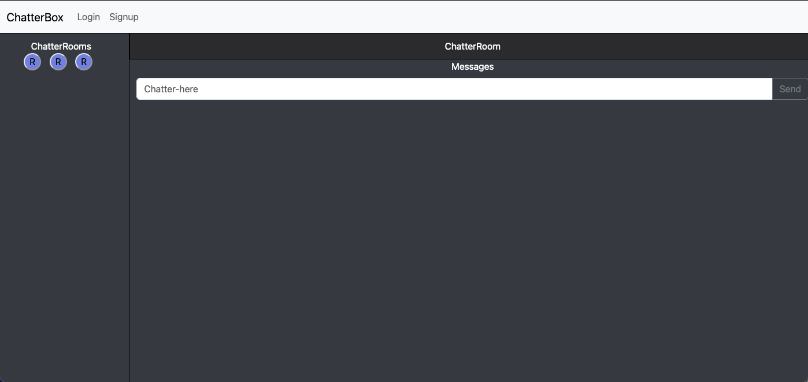

# Chatterbox Application

## Description
This application is a chat room website that allows the user to sign up with their own username and password to get access to different chat rooms. In these chat rooms, they have different topics and you can live chat with different people.

## Technologies Used
For our technologies, we used Node.js and Express.js to create an API, MySQL and Sequelize for the database, and we used Socket.io, which enables real time communication between users and servers.

## Screenshot

## Link to Deployed Application